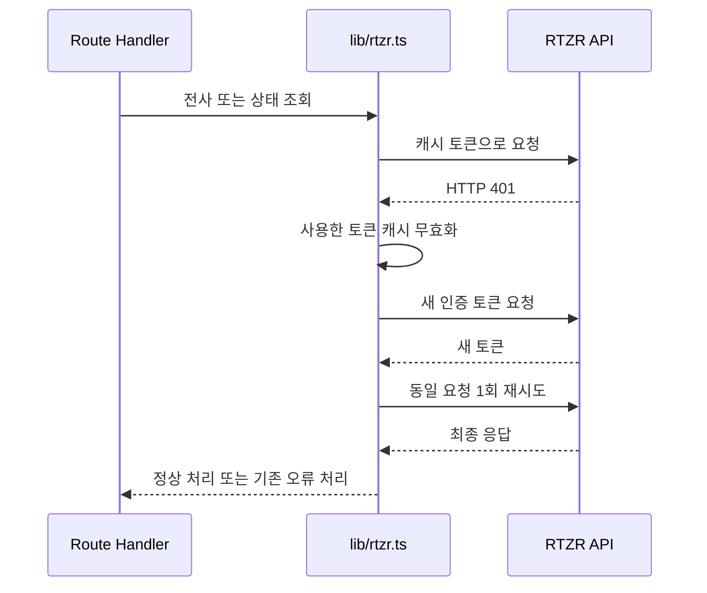

# Architecture

## 1. 설계 목표

AIVE Voice는 RTZR File STT API를 실제로 호출할 수 있는 로컬 실행형 웹 데모다. 설계 목표는 다음과 같다.

- 음성 업로드부터 전사 결과 탐색까지 하나의 화면에서 제공한다.
- RTZR 인증 정보와 인증 토큰을 브라우저에 노출하지 않는다.
- 별도의 백엔드 프로젝트나 데이터베이스 없이 설치와 재현을 단순하게 유지한다.
- 기능 수보다 API 요청 형식, 외부 응답 검증, 오류 처리의 정확성을 우선한다.
- 검색, 다운로드, 오디오 동기화는 원본 전사 배열을 바꾸지 않는 파생 처리로 구현한다.

## 2. 전체 구조

```mermaid
flowchart TD
    U[사용자 브라우저] -->|음성 파일과 선택적 키워드| C[Next.js Client Component]
    C -->|POST /api/transcriptions| P[POST Route Handler]
    P --> V[파일과 키워드 검증]
    V --> L[lib/rtzr.ts]
    L <-->|토큰 발급 또는 캐시 재사용| A[RTZR 인증 API]
    L <-->|전사 요청과 상태 조회| S[RTZR File STT API]
    L -->|전사 작업 ID| P
    P -->|전사 작업 ID| C
    C -->|5초 간격 GET /api/transcriptions/{id}| G[GET Route Handler]
    G -->|상태 조회| L
    L -->|정리된 상태 결과| G
    G --> T{상태}
    T -->|transcribing| C
    T -->|completed| D[화자별 발화와 타임스탬프 표시]
    T -->|failed 또는 오류| E[폴링 중단과 안전한 오류 표시]
```

브라우저는 애플리케이션 Route Handler만 호출한다. Route Handler는 입력을 검증한 뒤 `lib/rtzr.ts`를 통해 외부 API와 통신하고, 클라이언트에 필요한 최소 결과만 반환한다.

## 3. Next.js 단일 구조 선택

프론트엔드와 서버 Route Handler를 하나의 Next.js App Router 프로젝트에서 관리한다. 별도 FastAPI 서버나 데이터베이스를 두지 않아 로컬 설치 과정과 실행 단위를 줄였고, TypeScript 타입과 요청·응답 경계를 한 저장소에서 검토할 수 있게 했다.

이 선택은 작은 API 데모에서 재현성과 검토 편의성을 우선한 결과다. 클라이언트 UI, 서버 입력 검증, RTZR 연동 책임은 파일 단위로 나누되 별도의 서비스 배포는 만들지 않았다.

다음 한계가 있다.

- 장기 저장이나 사용자별 데이터 관리 기능이 없다.
- 프로세스가 종료되면 토큰 캐시가 사라지고, 브라우저를 닫으면 화면 상태도 유지되지 않는다.
- 규모가 커지거나 영구 저장·백그라운드 처리가 필요해지면 API 서버와 저장 계층을 분리할 수 있다.

## 4. 서버 중계 구조

브라우저가 RTZR API를 직접 호출하지 않고 Route Handler를 거치는 가장 중요한 이유는 인증 경계를 서버에 두기 위해서다. RTZR Client ID, Client Secret과 인증 토큰은 서버 코드에서만 사용하며 브라우저 번들이나 응답에 포함하지 않는다.

| 엔드포인트 | 책임 | 클라이언트 반환 |
|---|---|---|
| `POST /api/transcriptions` | `FormData` 파싱, 파일·키워드 검증, RTZR 전사 요청 | 성공 시 전사 작업 ID만 반환 |
| `GET /api/transcriptions/[id]` | ID 검증, RTZR 상태 조회, 상태별 결과 축소 | 상태와 완료 시 필요한 발화 배열 또는 안전한 오류 |

POST Route Handler는 파일 존재 여부와 `File` 타입, 0바이트 여부, `m4a`·`mp3`·`wav` 확장자를 검사한다. 선택적 `keywords`는 JSON 문자열 배열로 파싱한 뒤 trim, 빈 값 제거, 중복 제거를 수행하고 최대 500개, 항목당 20자, 완성형 한글 음절 조건을 검증한다.

GET Route Handler는 영문 대소문자, 숫자, `_`, `-`만 허용하는 패턴으로 작업 ID를 검사한다. `transcribing`, `completed`, `failed`를 구분하고, 완료 시 화면에 필요한 `utterances`만 반환한다.

두 Handler 모두 RTZR 원본 오류 메시지나 외부 응답 전체를 전달하지 않는다. 환경 설정, 인증, 전사 요청, 상태 조회 오류를 사용자가 이해할 수 있는 한국어 메시지와 정해진 HTTP 상태로 변환한다.

## 5. 인증 토큰 관리

### 토큰 캐싱

`lib/rtzr.ts`는 `access_token`과 초 단위 Unix timestamp인 `expire_at`을 모듈 변수에 보관한다. 캐시 재사용 조건은 다음과 같다.

```text
현재 시각 < expire_at - 300초
```

토큰 문자열이 비어 있지 않고 위 조건을 만족할 때만 재사용한다. 만료 5분 전부터는 기존 캐시를 사용하지 않고 새 토큰을 요청한다.

### 동시 인증 요청

진행 중인 인증 요청은 `authenticationPromise`에 저장한다. 여러 요청이 동시에 토큰을 필요로 하면 같은 Promise를 기다려 인증 API 중복 호출을 줄인다. 인증 성공 시에만 결과를 토큰 캐시에 저장하고, 성공과 실패 모두 `finally`에서 Promise 참조를 정리하므로 실패한 인증 결과는 유지되지 않는다.

### HTTP 401 재시도



POST 전사 요청은 요청 함수가 실행될 때마다 파일과 config로 새로운 `FormData`를 만든다. 따라서 첫 multipart body가 소비됐다고 가정하지 않고 재시도한다. GET 상태 조회도 같은 공통 흐름에서 한 번만 재시도한다. 두 번째 응답이 다시 401이거나 다른 오류라면 추가로 반복하지 않고 기존 오류 처리로 넘긴다. 인증 API 자체에는 이 재시도 구조를 적용하지 않는다.

캐시는 현재 Node.js 프로세스 안에서만 유지된다. 개발 서버 재시작 시 초기화되고 다중 인스턴스에서는 각 인스턴스가 별도 캐시를 사용한다. 로컬 프로토타입 범위에서는 분산 캐시나 외부 저장소를 추가하지 않았다.

## 6. 전사 요청과 폴링

클라이언트는 선택한 파일을 multipart `FormData`의 `file`로 전송한다. 키워드가 한 개 이상일 때만 정리된 배열을 JSON 문자열로 `keywords` 필드에 추가한다. 서버는 기존 RTZR config와 파일로 다시 `FormData`를 구성하고 성공 응답의 작업 ID를 런타임에서 검증한다.

상태 조회는 `setInterval`이 아니라 `setTimeout`을 한 번씩 예약하는 방식이다.

1. POST 성공 후 5초 뒤 첫 조회를 예약한다.
2. 응답이 `transcribing`일 때만 다음 5초 타이머를 등록한다.
3. `completed`이면 타이머를 정리하고 발화 배열을 저장한다.
4. `failed`, 예상하지 못한 상태, HTTP 오류 또는 응답 형식 오류면 폴링을 중단하고 오류를 표시한다.
5. 시작 시각으로부터 30분을 넘으면 폴링을 중단하고 타임아웃 오류를 표시한다.

`reset`과 컴포넌트 언마운트 시 남은 타이머를 제거한다. 업로드·전사 중에는 파일 입력과 드롭 처리를 막아 활성 폴링 중 파일이 교체되지 않게 한다. 완료·실패 경로도 다음 타이머를 예약하지 않는다.

File STT가 작업 ID를 먼저 반환하는 비동기 API이므로 이 방식이 파일 전사 데모에 적합하다. WebSocket이나 별도 서버 작업 큐 없이 완료 상태를 확인할 수 있지만, 상태 조회는 브라우저가 담당하며 네트워크 중단 후 자동 복구 기능은 없다. 30분 타임아웃도 실제로 재현하지 않았다.

## 7. RTZR 설정

| 옵션 | 설정 | 설계 이유 |
|---|---|---|
| `model_name` | `sommers` | 현재 한국어 인터뷰 전사에 선택한 모델이다. |
| `language` | `ko` | 인터뷰 언어를 한국어로 지정한다. |
| `use_diarization` | `true` | 인터뷰 참여자의 발화를 화자 번호로 구분한다. |
| `diarization.spk_count` | `2` | 2인 모의 인터뷰의 예상 화자 수를 전달한다. |
| `use_itn` | `true` | 영어·숫자·단위 표현을 표기 형태로 변환한다. |
| `use_disfluency_filter` | `true` | 간투어를 제거해 읽기 쉬운 대화록을 만든다. |
| `use_paragraph_splitter` | `true` | 긴 전사 내용을 문단 단위로 나눈다. |
| `paragraph_splitter.max` | `80` | 문단 최대 길이를 80자로 지정한다. |
| `domain` | `GENERAL` | 일반적인 인터뷰 대화에 일반 도메인을 사용한다. |
| `keywords` | 입력 시에만 포함 | 회사명·전공명·직무명 등 주요 용어의 인식을 보조한다. |

키워드 부스팅은 실측에서 일부 고유명사의 개선이 관찰됐지만 모든 오인식을 교정하지 않았고, 입력한 띄어쓰기나 영문 표기를 그대로 강제하지도 않았다. 하나의 음성 사례를 일반적인 성능 향상으로 해석하지 않는다.

## 8. 클라이언트 결과 처리

### 검색과 하이라이트

원본 `utterances` 배열은 상태로 유지하고 직접 변경하지 않는다. 현재 마스킹 설정을 적용한 `displayMessage`와 원본 배열 인덱스를 파생한 뒤, 검색어가 포함된 발화만 `visibleUtterances`로 필터링한다. 검색 결과 수는 일치 문자열 횟수가 아니라 필터를 통과한 발화 개수다.

하이라이트는 검색어의 정규식 특수문자를 escape하고 모든 일치 구간을 문자열과 `<mark>` React 노드 배열로 나눈다. `dangerouslySetInnerHTML`은 사용하지 않는다.

### TXT 다운로드

검색으로 필터링된 목록이 아니라 전체 `utterances`로 TXT를 만든다. 각 발화에 타임스탬프와 화자 번호를 포함하고 현재 마스킹 설정을 메시지에 적용한다. UTF-8 BOM을 포함한 `Blob`과 Object URL로 다운로드한 뒤 임시 anchor와 URL을 정리한다.

### 오디오 재생과 전사문 동기화

선택한 로컬 `File`로 브라우저 Object URL을 만들어 기본 `<audio>` 요소에서 재생한다. 애플리케이션 서버나 데이터베이스에 재생용 파일을 별도로 저장하지 않는다. 파일 변경과 초기화 시 오디오를 정지하고, 파일 변경 effect의 cleanup 및 컴포넌트 언마운트에서 URL과 대기 중인 메타데이터 리스너를 정리한다.

타임스탬프를 누르면 `start_at` 밀리초를 초로 변환해 재생 위치를 옮긴다. 메타데이터가 아직 없으면 `loadedmetadata`를 한 번 기다린다. 현재 재생 시각이 `start_at` 이상이고 `start_at + duration` 미만인 원본 발화를 활성 발화로 계산해 강조한다.

활성 인덱스가 바뀌고 오디오가 실제 재생 중일 때만 해당 항목을 화면 상단 근처로 부드럽게 스크롤한다. 같은 발화에서는 반복하지 않으며, 검색으로 활성 발화가 숨겨졌다면 스크롤하지 않는다.

## 9. 개인정보 표시 마스킹

```text
RTZR 원본 발화
  → 브라우저 상태에 보관
  → 마스킹 ON이면 표시 문자열 치환
  → 현재 표시 문자열로 검색·화면 렌더링
  → 현재 설정을 적용해 TXT 생성
```

`maskPersonalInfo()`는 다음 제한된 패턴을 `[전화번호]`와 `[이메일]`로 치환한 새 문자열을 반환한다.

- `010`으로 시작하는 11자리 번호와 하이픈·단일 공백 형식
- 일반적인 영문 표준 이메일 주소
- `앳`·`골뱅이`, `닷`·`점`과 제한된 도메인 발음으로 구성된 구어체 이메일

마스킹 OFF에서는 원본 발화를 표시하고, 검색도 현재 화면에 표시되는 문자열을 기준으로 수행한다. 원본 `utterances`는 수정하지 않는다.

RTZR 개인정보 필터가 별도 계약이 필요한 기능이므로 로컬 데모에서 표시 계층의 정규식 후처리를 검증하는 구조를 선택했다. 현재 서버나 데이터베이스에 전사 결과를 저장하지 않는 범위에서 적용 지점이 단순하다는 장점이 있다.

그러나 원본 결과는 브라우저 메모리에 존재하며 RTZR 전송 전 비식별화나 저장 전 삭제가 아니다. 이름, 주소, 주민등록번호, 계좌번호 등을 처리하지 않고 정규식 특성상 미탐지와 과탐지가 가능하다. 보안 기능이나 완전한 개인정보 보호 기능으로 사용할 수 없다.

## 10. 오류 처리

오류 처리는 클라이언트, Route Handler, RTZR 연동 계층으로 나뉜다.

| 계층 | 검증과 오류 처리 |
|---|---|
| 클라이언트 | 지원 확장자와 키워드 개수·길이·완성형 한글 검증, POST 작업 ID와 GET 상태 구조 확인, 30분 타임아웃 처리 |
| Route Handler | `FormData`, 파일 타입·0바이트·확장자, 키워드 JSON과 규칙, 작업 ID 형식, 환경변수 누락 검증 |
| RTZR 연동 | 인증·전사·상태 조회 HTTP 오류, RTZR 오류 응답, JSON 파싱 실패와 예상 응답 구조 불일치 구분 |

클라이언트는 알 수 없는 상태나 응답 구조를 성공으로 취급하지 않고 폴링을 중단한다. 자동 재생 실패는 전사 결과를 제거하거나 전사 phase를 실패로 바꾸지 않고 별도 안내 메시지로 표시한다.

Route Handler는 외부 오류의 원문 메시지나 인증 정보를 브라우저에 전달하지 않는다. 환경 설정, 인증, 요청 제한, 파일 제한과 조회 오류를 안전한 한국어 문구로 변환하고, 필요한 경우 400·403·404·410·413·429·500·502 상태로 구분한다. RTZR의 `failed` 상태도 원본 오류 대신 정리된 실패 메시지로 반환한다.

오류나 타임아웃이 발생하면 클라이언트는 다음 폴링을 예약하지 않고 진행 상태를 정리한다. 실제 RTZR `failed` 응답과 네트워크 연결 중단·복구 상황은 재현하지 않았다.

## 11. 현재 구조의 한계

- 데이터베이스와 전사 결과 영구 저장 기능이 없다.
- 오디오 재생은 브라우저의 로컬 Object URL에 의존한다.
- 인증 토큰 캐시는 Node.js 프로세스 범위에 한정된다.
- 장시간·대용량 파일과 배포 환경은 검증하지 않았다.
- 화자 분리 정확도와 타임스탬프 오차를 정량 평가하지 않았다.

## 12. 확장 방향

다음은 현재 구현이 아닌 향후 확장 후보다.

1. 서버 저장과 작업 큐를 도입한 장시간 음성 처리
2. 서버 단계 개인정보 비식별화 또는 NER 기반 탐지
3. LLM을 연결한 인터뷰 요약과 게시글 초안 생성
